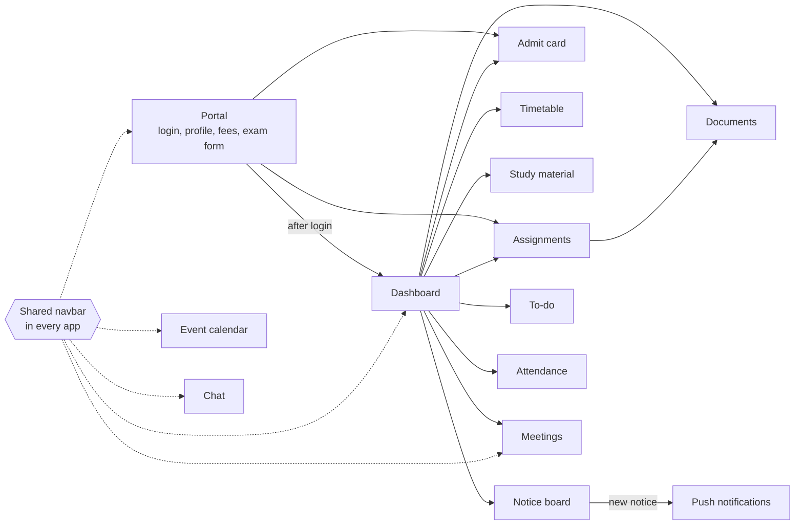

# EdConnect

EdConnect is a college portal that puts a student's day-to-day tools in one place: classes, assignments, attendance, notices, study material, exams, chat and online sessions. We built it as our minor project at Guru Nanak Dev Engineering College between February and April 2024.

It is not one application. It is fifteen small web apps, each built and deployed on its own, that behave like one product because they share a navigation bar, link to each other, and mostly use the same MongoDB database. This repository brings all of them, and the prototypes that led to them, into one place.

## What a student can do

- **Sign in and manage their account**: register, log in, view their profile, fee details and exam form.
- **See the day at a glance**: a dashboard with attendance, course progress, a calendar and the class schedule.
- **Keep up with coursework**: timetable, assignments, study material by branch and semester, and a personal to-do list.
- **Stay informed**: a notice board, browser push notifications when a notice is posted, and an event calendar.
- **Talk to people**: real-time chat, video meetings for online classes, and a discussion forum.
- **Handle paperwork**: upload documents and download an admit card as a PDF.

## How it fits together



Three things tie the apps together:

1. **A shared navbar.** The same `Navbar.jsx` is copied into each app and links to the dashboard, event calendar, meetings, chat and the account pages in the portal.
2. **Links from the hubs.** The portal's sidebar and the dashboard's tiles open the other modules.
3. **One database.** Most back ends connect to the same MongoDB Atlas cluster, so, for example, the admit card reads the users that the portal registers.

## Modules

Everything under `apps/` was part of the working product.

| Folder | What it does | Built with | Mostly built by |
|---|---|---|---|
| [`apps/portal`](apps/portal) | Start page, registration and login, student profile, fee details, exam form, attendance view, feedback and settings. Sends students to the dashboard after login. | React, Express, Mongoose, JWT | Ranbir-GNE, gundeeps247 |
| [`apps/dashboard`](apps/dashboard) | Home screen with attendance histogram, course charts, calendar and schedule, plus tiles that open the other modules. | React, Chart.js, Express, Mongoose | Ranbir-GNE, Sukhmangill977 |
| [`apps/timetable`](apps/timetable) | Weekly timetable grid: days against six periods. | React, Express, Mongoose | Sukhmangill977, gundeeps247 |
| [`apps/assignments`](apps/assignments) | Teacher view to post assignments; student view to open them as PDFs and upload work. | React, react-pdf | Sukhmangill977, gundeeps247 |
| [`apps/admit-card`](apps/admit-card) | Looks up a student's record and renders an admit card that downloads as a PDF. | React, jsPDF, html2canvas, Express, Mongoose | Sukhmangill977 |
| [`apps/study-material`](apps/study-material) | Google Drive links to study material, organised by branch and semester. | React | Ranbir-GNE, Savy011 |
| [`apps/documents`](apps/documents) | Drive-style file store: sign in with Google, upload files, list them. | React, Firebase Auth, Firestore, Storage | Sukhmangill977, gundeeps247 |
| [`apps/meetings`](apps/meetings) | Create, schedule and join one-to-one meetings and video conferences. | React, TypeScript, Redux Toolkit, Firebase, ZEGOCLOUD | Sukhmangill977, gundeeps247 |
| [`apps/chat`](apps/chat) | Real-time one-to-one and group chat with typing indicators. | React, Chakra UI, Socket.IO, Express, Mongoose, JWT | gundeeps247, Sukhmangill977 |
| [`apps/notice-board`](apps/notice-board) | Add, edit and delete notices with images. Posting a notice can send a push notification. | React, Express, Mongoose, Cloudinary | gundeeps247, Sukhmangill977 |
| [`apps/notifications`](apps/notifications) | Browser push notifications. A service worker subscribes the browser; the server stores subscriptions and pushes to all of them. | HTML and JavaScript, service worker, Express, web-push, MongoDB | gundeeps247, yashgoyal-16 |
| [`apps/attendance`](apps/attendance) | An admin adds students and marks classes attended; students log in to see their count. | React, Express, Mongoose | gundeeps247, Ranbir-GNE |
| [`apps/event-calendar`](apps/event-calendar) | Month calendar where events are created and stored. | React, FullCalendar, Express, Mongoose | Sukhmangill977 |
| [`apps/todo`](apps/todo) | Personal task list with accounts, active and completed views, and password reset by email. | React, MUI, Tailwind, Express, Mongoose, JWT, Nodemailer | gundeeps247, Sukhmangill977 |
| [`apps/forums`](apps/forums) | Reddit-style discussion board with communities, posts, comments and votes. | Next.js, TypeScript, Tailwind, NextAuth, Apollo, StepZen GraphQL, Postgres | gundeeps247 |

### Prototypes

Earlier attempts and experiments, kept for the record. None of these were part of the final product.

| Folder | What it was |
|---|---|
| [`prototypes/dashboard-v1`](prototypes/dashboard-v1) | The first dashboard (9–10 March 2024), continued as `apps/dashboard`. |
| [`prototypes/admit-card-generator`](prototypes/admit-card-generator) | The first admit card attempt, with exam and student models. |
| [`prototypes/admit-card-gundeep`](prototypes/admit-card-gundeep) | A second admit card implementation built in parallel. |
| [`prototypes/uploader`](prototypes/uploader) | A Firebase file-upload experiment that led to `apps/documents`. |
| [`prototypes/push-notifications`](prototypes/push-notifications) | A Firebase Cloud Messaging experiment that came before the Web Push version in `apps/notifications`. |
| [`prototypes/todo-backend`](prototypes/todo-backend) | A login and task API for a to-do service, replaced by `apps/todo`. |
| [`prototypes/automated-notifications`](prototypes/automated-notifications) | A placeholder that never got past its README. |

## Running a module

Each module is independent, so you run only the one you want. You need Node.js 20.6 or newer and, for most back ends, a MongoDB connection string.

```bash
git clone https://github.com/gundeeps247/EdConnect.git
cd EdConnect/apps/notice-board/backend
npm install
cp .env.example .env        # then fill in your own values
node --env-file=.env server.js
```

Then, in a second terminal, start the matching front end:

```bash
cd EdConnect/apps/notice-board/frontend
npm install
npm start
```

Where each module keeps its code:

| Module | Front end | Back end | API port |
|---|---|---|---|
| portal | `client/` | `server/` (`server.js`) | 5000 |
| dashboard | `client/` | `server/` (`index.js`) | 5012 |
| timetable | `client/` | `server/` (`server.js`) | 5000 |
| assignments | `assignments/` | none | |
| admit-card | `client/` | `server/` (`server.js`) | 5010 |
| study-material | the module folder itself | none | |
| documents | the module folder itself | Firebase | |
| meetings | the module folder itself | Firebase and ZEGOCLOUD | |
| chat | `frontend/` | `backend/` (`server.js`), started from the module folder | 5000 |
| notice-board | `frontend/` | `backend/` (`server.js`) | 5001 |
| notifications | `index.html`, `script.js`, `sw.js` | `server/` (`app.js`) | |
| attendance | `client/` | `server/` (`index.js`) | 8000 |
| event-calendar | `client/` | `server/` (`server.js`) | 5002 |
| todo | `frontend/` | `backend/` (`server.js`) | 8001 |
| forums | the module folder itself (`npm run dev`) | StepZen and Postgres | |

### Configuration

No credentials are stored in this repository. Before a module will run you need to supply your own:

- **Back ends** read their settings from environment variables. Every folder that needs them has a `.env.example` listing the names. Starting a server with `node --env-file=.env` loads the file whether or not that server uses `dotenv`.
- **Firebase apps** (`apps/documents`, `apps/meetings`, `prototypes/uploader`, `prototypes/push-notifications`) have `YOUR_FIREBASE_API_KEY` in their Firebase config file. Replace the config object with the one from your own Firebase project.
- **Meetings** also needs a ZEGOCLOUD server secret in `REACT_APP_ZEGOCLOUD_SERVER_SECRET`.
- **Forums** needs a Postgres connection in `stepzen/config.yaml`, a StepZen key and Reddit OAuth credentials.

## Deployments

The apps were deployed separately, front ends on Vercel and back ends on Render. This is what still loaded on 8 October 2026. The back ends ran on a free tier, so pages may open without their data.

| Module | Address | Status |
|---|---|---|
| Portal | `ed-connect.vercel.app` | Offline |
| Dashboard | `edconnect-dashboard-blond.vercel.app` | Offline |
| Dashboard, first version | [edconnect-dashboard.vercel.app](https://edconnect-dashboard.vercel.app/) | Loads |
| Timetable | [time-table-c8ro.vercel.app](https://time-table-c8ro.vercel.app/) | Loads |
| Assignments | [assignments-edconnect.vercel.app](https://assignments-edconnect.vercel.app/) | Loads |
| Admit card | [admitcard-edconnect.vercel.app](https://admitcard-edconnect.vercel.app/) | Loads |
| Study material | [study-material-edconnnect.vercel.app](https://study-material-edconnnect.vercel.app/) | Loads |
| Documents | [edconnect-documents.vercel.app](https://edconnect-documents.vercel.app/) | Loads |
| Meetings | [edconnect-meeting.vercel.app](https://edconnect-meeting.vercel.app/) | Loads |
| Chat | [chat-psi-jet.vercel.app](https://chat-psi-jet.vercel.app/) | Loads |
| Notice board | [notice-board-nine.vercel.app](https://notice-board-nine.vercel.app/) | Loads |
| Notifications | [notification-phi-gold.vercel.app](https://notification-phi-gold.vercel.app/) | Loads |
| Attendance | [attendance-gold.vercel.app](https://attendance-gold.vercel.app/) | Loads |
| Event calendar | [event-calender-edconnect.vercel.app](https://event-calender-edconnect.vercel.app/) | Loads |
| To-do | [mern-todo-roan.vercel.app](https://mern-todo-roan.vercel.app/) | Loads |

Because the portal and the dashboard are offline, the Dashboard, My Account, Settings and Logout links in the shared navbar no longer lead anywhere.

## Known limitations

- **No single sign-on.** The portal, chat, to-do, attendance and meetings each have their own login. Signing in to one does not sign you in to the others.
- **Hard-coded addresses.** The navbar and the front ends point at the 2024 deployment URLs. To run everything locally you have to change those addresses in the source.
- **The navbar is copied, not shared.** Each app has its own copy of `Navbar.jsx`, so a change has to be made in every app.
- **Uneven depth.** Some modules are complete features with a back end; others, such as the timetable and study material, are front ends over fixed data.

## Team

| | GitHub | Worked mainly on |
|---|---|---|
| Gundeep Singh | [@gundeeps247](https://github.com/gundeeps247) | Chat, notice board, notifications, attendance, to-do, forums, and wiring the apps together |
| Ranbir | [@Ranbir-GNE](https://github.com/Ranbir-GNE) | Portal, dashboard, study material |
| Sukhman | [@Sukhmangill977](https://github.com/Sukhmangill977) | Dashboard, timetable, assignments, admit card, documents, meetings, event calendar |

With contributions from [@Savy011](https://github.com/Savy011) (study material), [@yashgoyal-16](https://github.com/yashgoyal-16) (notifications) and [@whogurdevil](https://github.com/whogurdevil) (first dashboard).

## About this repository

EdConnect was originally spread across 23 repositories, one per module or experiment. They were merged here in October 2026:

- **History is kept.** Each module's commits were imported with their original authors and dates, 307 commits in all. `git log -- apps/chat` shows the history of one module.
- **Dependencies and build output were left out.** Several of the original repositories had `node_modules` committed; those, compiled `build/` folders and `.DS_Store` files were dropped.
- **Credentials were removed.** `.env` files were dropped, and hard-coded connection strings and keys were replaced with environment variables or placeholders throughout the history.
- **Folders were renamed** for consistency. The original repository names were:

| Folder | Original repository |
|---|---|
| `apps/portal` | Components-Minor |
| `apps/dashboard` | Academics |
| `apps/timetable` | time_table |
| `apps/assignments` | assignment |
| `apps/admit-card` | admitcard |
| `apps/study-material` | study-material |
| `apps/documents` | edconnectuploader |
| `apps/meetings` | edconnect-meeting |
| `apps/chat` | chat |
| `apps/notice-board` | notice-board |
| `apps/notifications` | notification |
| `apps/attendance` | attendance |
| `apps/event-calendar` | event_calender |
| `apps/todo` | mern_todo |
| `apps/forums` | forums |
| `prototypes/dashboard-v1` | edconnect-dashboard |
| `prototypes/admit-card-generator` | Admitcard_generator |
| `prototypes/admit-card-gundeep` | admit-card-gundeep-s-contribution |
| `prototypes/uploader` | uploader |
| `prototypes/push-notifications` | push-notifications |
| `prototypes/todo-backend` | todo-edconnect |
| `prototypes/automated-notifications` | automated-notifications |

## Licence

MIT. See [LICENSE](LICENSE).
